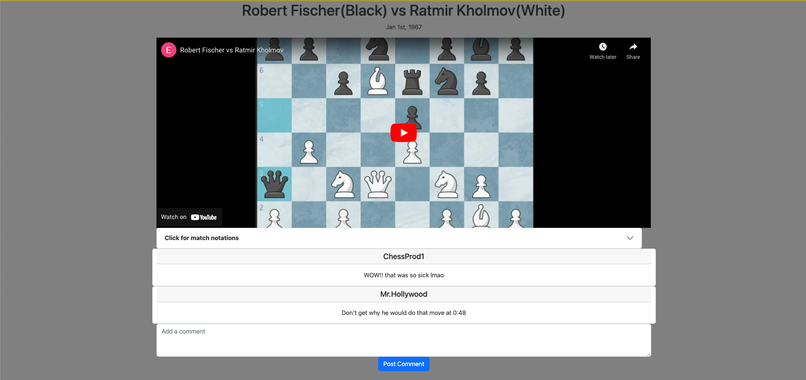

# get-pawned-chess-game-

## Description 
(Still in beta)
Get Pawned Chess is an application created to bring the global chess community together, while also teaching the next generation of chess grandmasters. Currently, the web application is still in beta mode which allows a user to view famous historical chess games and the notations. The final product will also include a playable chess game; allowing the community to hone in their chess strategies.

## Installation 

Please refer to [Example.env](EXAMPLE.env) before using the application through node.js 

## Usage
Deploy link: https://shrouded-citadel-52847.herokuapp.com/

### Inital Page 

### Login Page 

### View All Games 

### Challenge Page 

## Credits 

### Contributors: 

1. [Edgar Mendez](https://github.com/edgarmendez94)
2. [Kamal Kaur](https://github.com/kamal1198)
3. [Michael Moreno](https://github.com/mmoreno723)
4. [Sa uk Chung](https://github.com/saukchung)
5. [Saad Mian](https://github.com/SDMNNY)

### Resources used:

[MySQL](https://www.mysql.com/)

[Handlebars](https://handlebarsjs.com/)

[Bootstrap](https://getbootstrap.com/)

[Node.js](https://nodejs.org/en/)

[Javascript](https://www.javascript.com/)

## License 
Copyright (c) [GET PAWNED] [2022]

